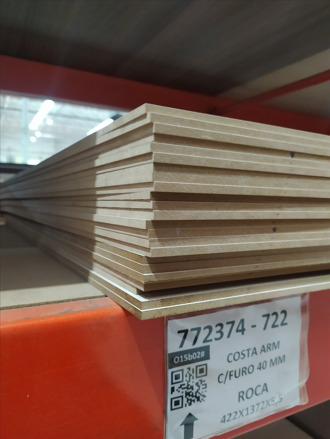
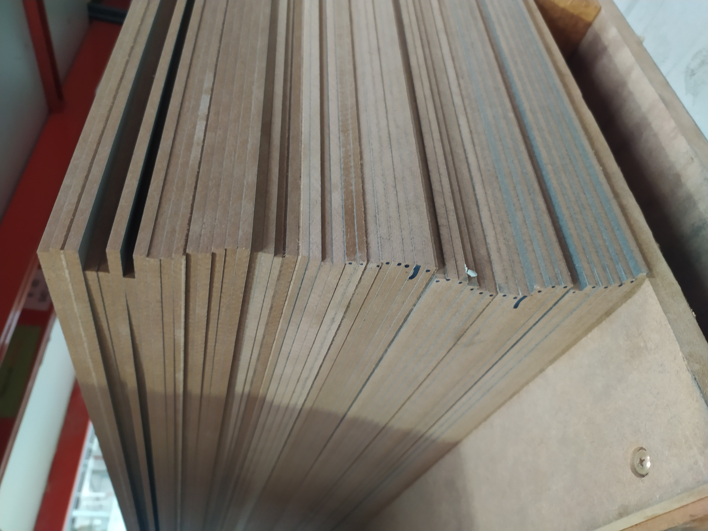
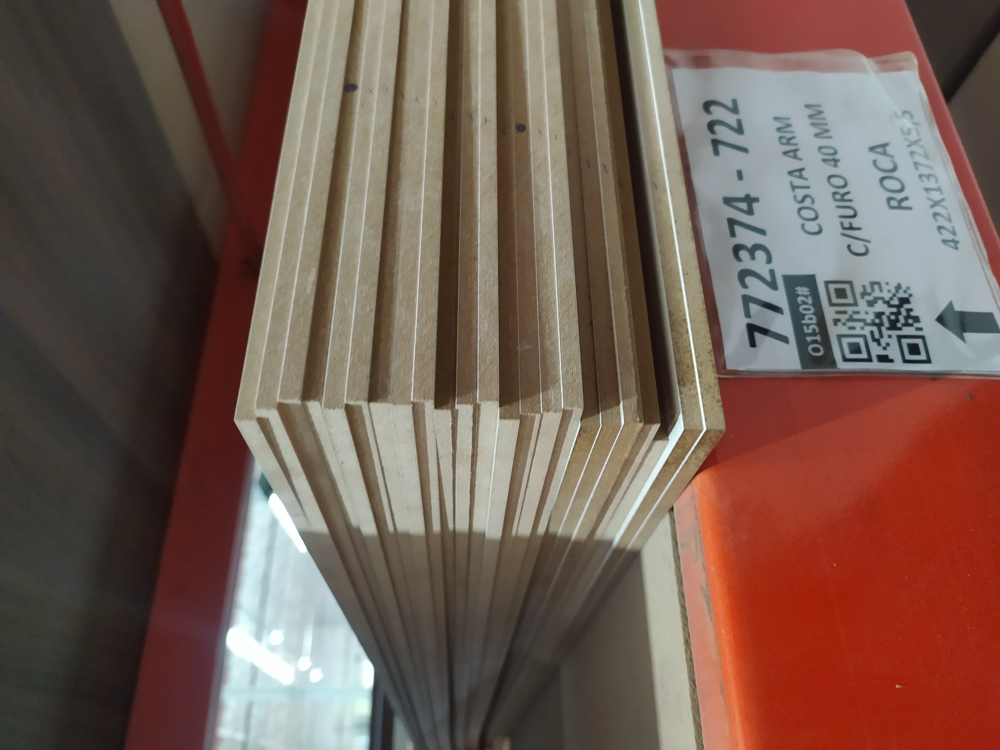
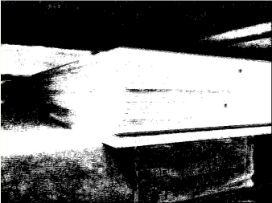
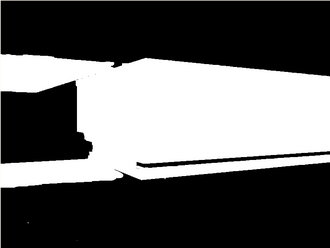
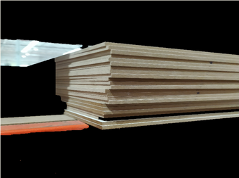
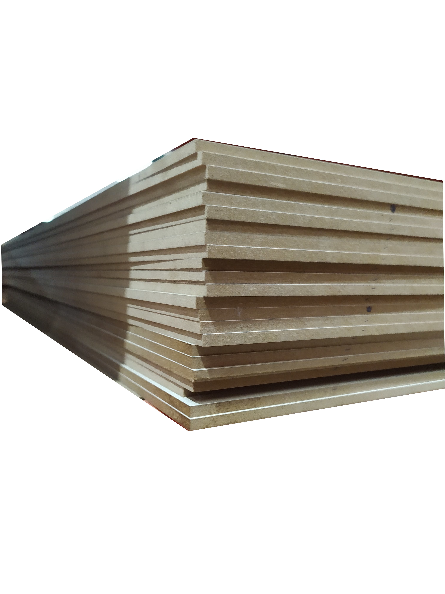

# Desafio Pix Force

## Descrição
Este projeto foi desenvolvido como parte do Desafio Pix Force, organizado pela 6ª DPVSA. O objetivo do desafio é criar métodos de contagem para alguns objetos específicos. Os objetos que podem ser escolhidos pela equipe são:
- Placa
- Perfil
- Cantoneira

As soluções desenvolvidas devem obrigatoriamente contemplar ao menos as opções de contagem de Placa e Perfil. A contagem da Cantoneira será considerada na avaliação final como pontuação extra.

## Funcionalidades
- Contagem de objetos em imagens
- Processamento de imagens anotadas e não anotadas
- Aplicação de técnicas de visão computacional e aprendizado de máquina

## Tecnologias Utilizadas
- Python
- OpenCV
- TensorFlow
- NumPy

## Introdução
A motivação inicial deste trabalho foi o desenvolvimento rápido de métodos eficientes para a contagem automatizada de chapas de madeira em ambientes industriais. No contexto do desafio PixForce 2022, culminou na participação da equipe encabeçada pelos autores deste artigo na final do desafio.

## Métodos usados
Este trabalho propôs duas metodologias que utilizam filtros e convoluções para contar o número de objetos, como tábuas, em um ambiente industrial. Sendo essas abordagens uma baseada em patches, uso de SVM junto ao GrabCut e outra que empregou recortes manuais para gerar filtro mais correto possível focado nas tábuas para cada imagem.

### Work Flow


O dataset possui 150 imagens de placas MDP em uma visão de canto das pilhas. Todas as placas possuem a mesma espessura, mas devido à variação de posicionamento, as espessuras acabam parecendo diferentes na imagem. Foram enviados juntos arquivos JSON com especificações sobre anotações que, ao final, foram retirados o número de placas de cada imagem para usarmos como comparativo no final do processo de contagem, a fim de obter uma porcentagem de acertos.

### Exemplos imagens do diretório
<p align="center">
  
  
  
</p>

Uma abordagem eficaz para essa tarefa é a utilização do método de "patches" em conjunto com o algoritmo de aprendizado de máquina SVM e o algoritmo "GrabCut", a fim de retirar o fundo das imagens e obter uma melhor separação entre o objeto principal e o fundo da imagem. Ambos os métodos foram empregados em apenas um dos métodos (método I). A utilização do aplicativo GIMP para a remoção manual do fundo, obtendo assim somente a parte necessária para a aplicação dos filtros, foi a outra abordagem empregada (método II).

### Segmentação usando patches em conjunto com SVM e Grabcut




### Resultado caminho I e II

<p align="center">
  
  
</p>

O uso do filtro Canny após o processamento inicial é importante para melhorar a detecção de bordas, destacando melhor as características dos objetos de interesse, como texturas e padrões. Ele também reduz ruídos e remove pequenos artefatos, resultando em bordas mais nítidas, o que facilita a análise visual em classificações de materiais.


### Filtro Canny  


A convolução foi usada para identificar e medir as distâncias entre as bordas da imagem, com o objetivo de calcular a espessura das tábuas. Após a detecção de bordas via filtro Canny, a convolução foi aplicada para destacar as transições de intensidade nas colunas da imagem, evidenciando bordas. A técnica ajudou a calcular a distância entre as bordas ao produzir picos onde as transições eram mais acentuadas, permitindo uma análise precisa da espessura das tábuas.

### Convolução


 Após detectar as bordas, uma filtragem é aplicada para remover ruídos e flutuações, estabelecendo um valor limite para identificar transições significativas. A mediana das espessuras obtidas é calculada, garantindo uma estimativa precisa da espessura das tábuas. Esse processo contribui para uma análise eficaz e parcialmente precisa na identificação e contagem das tábuas, possibilitando uma avaliação automatizada.
 
## Contribuição
Sinta-se à vontade para contribuir com este projeto. Para isso, siga os passos abaixo:
1. Faça um fork do projeto
2. Crie uma branch para sua feature (`git checkout -b feature/nova-feature`)
3. Commit suas mudanças (`git commit -m 'Adiciona nova feature'`)
4. Faça um push para a branch (`git push origin feature/nova-feature`)
5. Abra um Pull Request

## Como Executar
1. Clone o repositório:
    ```bash
    git clone https://github.com/seu-usuario/desafio-pix-force.git
    ```
2. Instale as dependências:
    ```bash
    pip install -r requirements.txt
    ```
3. Execute o script principal:
    ```bash
    python main.py
    ```
## Licença
Este projeto está licenciado sob a Licença MIT - veja o arquivo LICENSE para mais detalhes.
